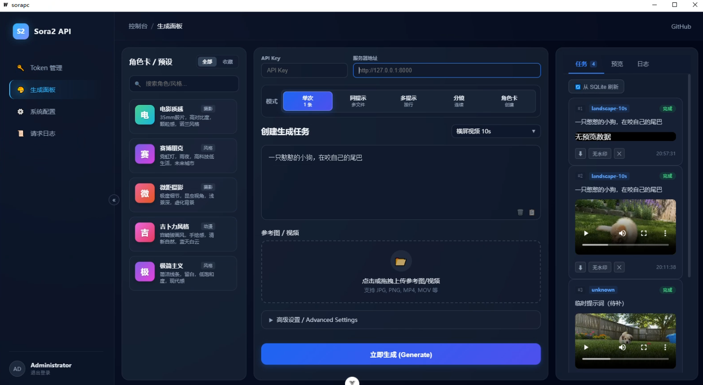
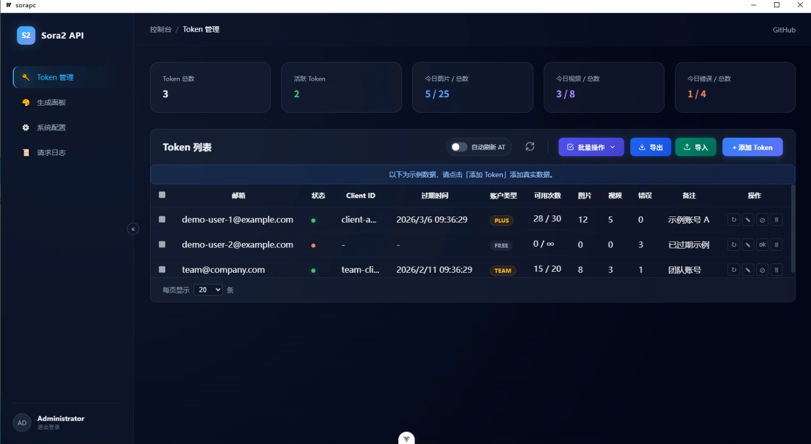

# Sorapc

[](https://qm.qq.com/cgi-bin/qm/qr?k=kSKwz-HRqrddrALgfLqCp7C2-aGZqPlv&jump_from=webapi&authKey=KUwPZ1lgzoIXjwIf/AfQ0UFFhRcUAO8VAdZk2kVdrGHQhxyhlgn30vX1SCX5Lu8d) (群号: 83958598)

## 关于本项目

- **前端开源、后端闭源**：本仓库为**商业项目**，仅开放前端与桌面壳相关代码；后端服务为闭源商业产品，**并非免费项目**。
- **接入方式**：您也可以**接入自己的 API**（自建或兼容接口），在应用内配置服务器地址后即可使用本客户端连接自有后端。

基于 Wails + Vue 的桌面应用，前端使用 Vite 构建。项目配置可编辑根目录下的 `wails.json`，更多说明见：<https://wails.io/docs/reference/project-config>

## 界面预览





## 环境要求

- **Go 1.23**（当前项目版本，见 `go.mod`）
- Node.js（用于前端构建）
- 安装 Wails CLI：`go install github.com/wailsapp/wails/v2/cmd/wails@latest`

## 开发模式

在项目根目录执行：

```bash
wails dev
```

会启动 Vite 开发服务器，前端支持热重载。若在浏览器中开发并需要调用 Go 方法，可访问开发服务地址（如 http://localhost:34115），在开发者工具中调用 Go 暴露的接口。

也可带参数运行：

- `sorapc -dev` 或 `sorapc -debug`：连接到开发服务器（需先运行 `wails dev`）

## 构建

生成生产环境可执行文件：

```bash
wails build
```

Windows 下可使用 `pack_windows.bat` 进行打包，输出在 `dist\sorapc-win` 目录。

## 项目结构

- `main.go`：程序入口，Wails 应用配置
- `app.go`：业务逻辑与 Go 暴露给前端的接口
- `frontend/`：Vue 3 + Vite 前端
- `wails.json`：Wails 项目配置
